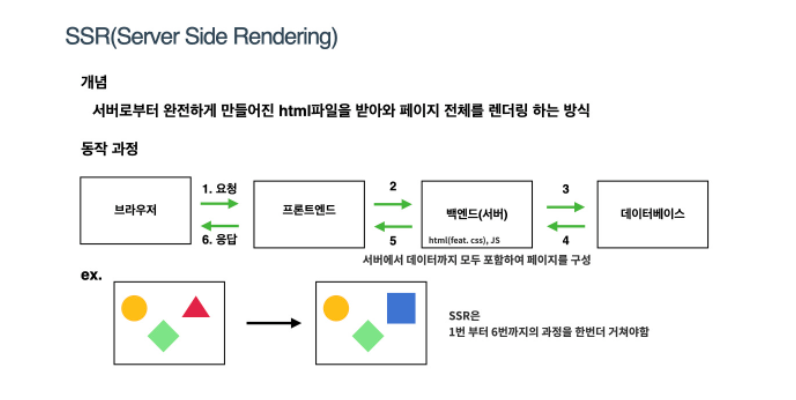
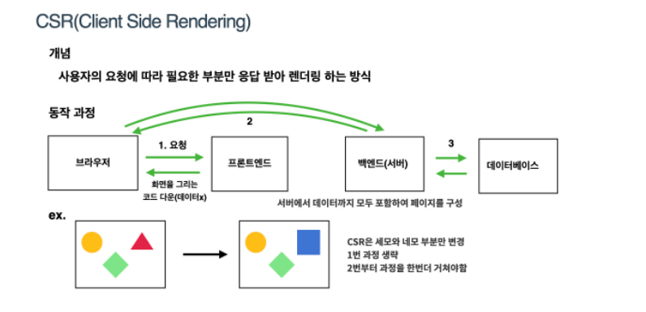

# SSR(Sever Side Randering) 
## SSR 이란 ? 
브라우저에서 서버에 페이지를 요청할 때 마다 완전하게 만들어진 HTML, CSS, JS 파일을 받아와 해당 페이지를 렌더링 하는 방식이다.

## 장점
* 초기 로딩 속도가 빨라 사용자에게 콘텐츠를 빠르게 보여줄 수 있다.
* 검색엔진 최적화(SEO) 가능 
## 단점
* 서버에 패이지를 매번 요청 하기 때문에 서버의 부하가 커진다.
* 페이지 이동 시 새로고침이 발생하기 때문에 화면이 깜빡거린다.

# CSR(Client Side Randering)
## CSR 이란? 
서버에서 HTML 파일을 처리하지 않고 브라우저의 자바스크립트를 통해 상호작용하는 방식이다. 

## 장점
* 첫 로딩만 기다리면 동적으로 빠르게 렌더링 되기 때문에 사용자 친화적이다.
* 서버의 요청하는 횟수가 적기 때문에 서버의 부담이 적다.
## 단점
* 모든 JS파일을 받아야 되기 때문에 초기 로딩 속도가 느리다.
* 자바스크립트를 사용하여 사용자의 상호작용 후에 페이지가 로드(그전에 내용을 볼수 없다 )
  * 검색엔진의 검색 봇이 크롤링을 하는데 어려움을 겪기 때문에 SEO에 불리하다.

# 참고
* [SSR(서버사이드 렌더링)과 CSR(클라이언트 사이드 렌더링)](https://miracleground.tistory.com/165)
* [CSR(Client Side Rendering)과 SSR(Server Side Rendering)](https://github.com/baeharam/Must-Know-About-Frontend/blob/main/Notes/frontend/csr-ssr.md)

