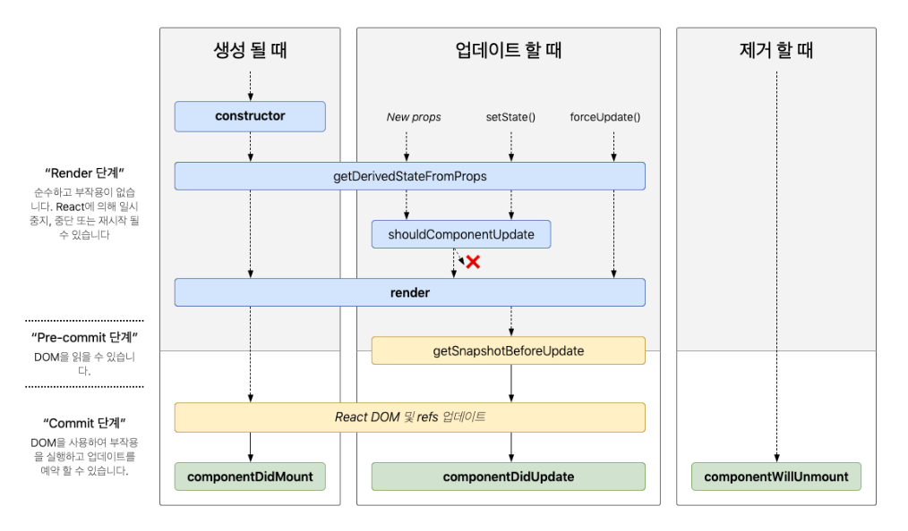

# **useEffect**

## useEffect란?
- useEffect는 리액트 컴포넌트가 랜더링 될 때마다 특정 작업을 실행할 수 있도록 하는 Hook이다.
- useEffect는 component가 mount, unmount, update됐을때 특정 작업을 처리할 수 있다. 이는 클래스형 컴포넌트에서 사용할 수 있었던 생명주기 메소드를 함수형 컴포넌트에서도 사용할 수 있게  된것이다.

* componentDidMount : 컴포넌트를 만들고 , 첫 렌더링을 다 마친 후 실행
* componentDidUpdate : 리렌더링을 완료한 후 실행, 즉 render()가 업데이트 될 때마다 실행
* componentWillUnMount : 컴포넌트를 DOM에서 제거할 때 실행
