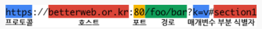

# HTTP 프로토콜이란?
HTTP는 HTML문서 와 같은 리소스들을 가져올 수 있도록 해주는 프로토콜이다. 웹에서 이루어지는 모든 데이터 교환의 기초이며 클라이언트 - 서버 프로토콜이기도 하다.
프로토콜이란 상호 간에 정의한 규칙을 의미하며 특정 기기 간에 데이터를 주고받기 위해 정의되었다.

# HTTP 동작
클라이언트 측, 사용자가 브라우저를 통해서 어떠한 서비스를 URL을 통하거나 다른 것들을 통해서 요청(Request)을 하면 서버에서는 해당 요청사항에 맞는 결과를 찾아서 사용자에게 응답(Response)하는 형태로 동작한다.
* 요청 : 클라이언트 -> 서버
* 응답 : 서버 -> 클라이언트 

# URL
서버에 자원을 요청하기 위해 입력하는 영문 주소이며 URL에 구조는 아래와 같다. 

# HTTP 
* **GET** : 서버에 조회할 리소스 조회 요청(READ,조회)
* **POST** : 서버에 생성할 데이터를 삽입하여 전송한다.(CREATE,생성)
* **PUT** : 서버에 본문에 수정할 데이터를 삽입하여 전송한다.(UPDATE,수정)
* **DELETE** : 서버에 삭제할 리소스 요청(DELETE,삭제)
* **PATCH** : PUT은 전부다 수정 하지만 PATCH는 수정된 부분만 수정한다.
* **HEAD** : 서버에 헤더 정보를 획득, GET과 비슷하지만 Response Body를 반환하지 않는다.
* **OPTIONS** : 서버에 옵션들을 확인하기 위한 요청. CORS에서 사용한다. 

# HTTP 상태 코드 
HTTP 상태코드는 서버에서 설정해주는 응답(Response) 정보이다.
* **2XX(성공)** : 요청을 성공적으로 받았으며 인식하고 수용한다.
* **3XX(리다이렉션)** : 요청 완료를 위한 추가적인 작업 조치가 필요하다.
* **4XX(클라이언트 오류)** : 요청 문법이 잘못 되었거나 요청을 처리 할 수 없다.
* **5XX(서버 오류)** : 서버가 명백히 유효한 요청에 대한 충족을 실패한 경우

# 참고 
* [프런트엔드 개발자가 알아야하는 HTTP 프로토콜 Part 1](https://joshua1988.github.io/web-development/http-part1/)
* [취준생이 반드시 알아야 할 프론트엔드 지식들](https://github.com/baeharam/Must-Know-About-Frontend/blob/main/Notes/network/http.md)
